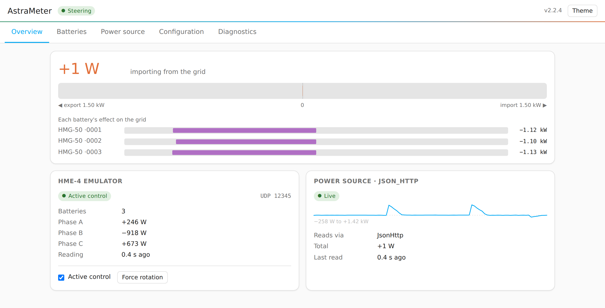
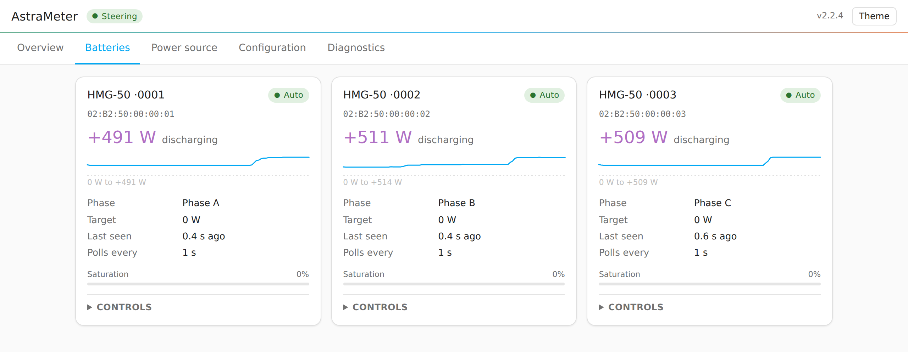
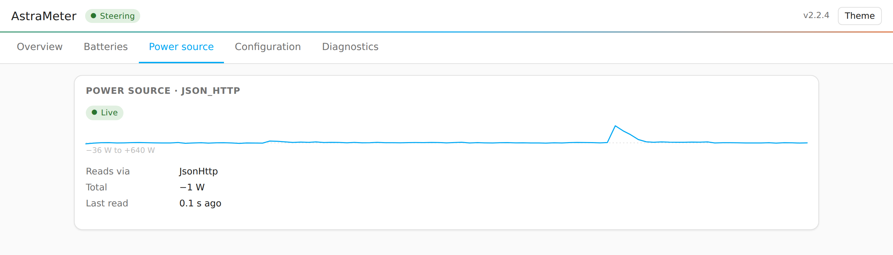
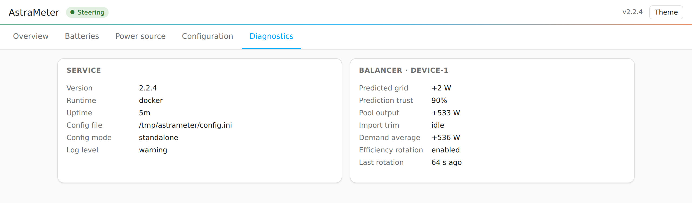

# Live status dashboard

An opt-in web page that shows what AstraMeter is doing right now — grid power,
every battery's target and reported power, the health of your power source, and
the balancer's internal state — and lets you change your configuration without
editing files by hand.

## Contents

- [What it shows](#what-it-shows)
- [Enabling it](#enabling-it)
  - [Home Assistant add-on](#home-assistant-add-on)
  - [Docker / standalone](#docker--standalone)
- [Changing your configuration](#changing-your-configuration)
  - [Guided setup](#guided-setup)
  - [Config file](#config-file)
  - [Switching between them](#switching-between-them)
- [Security](#security)
- [Troubleshooting](#troubleshooting)

## What it shows

**Overview** — the headline is a single signed bar with zero pinned at the
centre: export to the left, import to the right. Underneath, each battery's
effect on the grid is drawn on that same axis, so you can see at a glance that
the batteries are what pull the grid back to zero. Beside it are the emulator's
state (active control or relay mode, batteries connected, per-phase readings)
and the power source's health.

<picture>
  <source media="(prefers-color-scheme: dark)" srcset="images/dashboard-overview-dark.png">
  
</picture>

**Batteries** — one card per battery: reported power, the target AstraMeter
asked for, the phase it reported, how long ago it last polled, its distribution
weight and its saturation. If changes are allowed you can disable a battery or
return one to automatic control from here.

<picture>
  <source media="(prefers-color-scheme: dark)" srcset="images/dashboard-batteries-dark.png">
  
</picture>

**Power source** — every configured meter, what reads it, the filter chain
applied to it (smoothing, spike rejection, PID) and when it was last read.

<picture>
  <source media="(prefers-color-scheme: dark)" srcset="images/dashboard-sources-dark.png">
  
</picture>

**Diagnostics** — service version, uptime, config file and mode, plus the
balancer's internals. Each balancer card leads with its **control quality**:
whether the grid is being held at zero, with the mean error, time inside the
band and zero-crossing rate behind it (see
[Control quality](ct002.md#control-quality)), followed by the predicted grid
power, prediction trust, pool output, import trim, the demand average and the
efficiency rotation state. MQTT Insights connection state appears here when it
is configured.

<picture>
  <source media="(prefers-color-scheme: dark)" srcset="images/dashboard-diagnostics-dark.png">
  
</picture>

The battery and power-source cards each carry a small **trend line** of their
own figure, with the range it covered underneath. It is built in your browser
from the readings the page has already polled — nothing is stored, so it starts
empty on every load and covers only as long as the tab has been open.

Values a backend cannot supply are **omitted**, never shown as `0` or `—`, so
an empty field always means "not reported" rather than "measured as zero".

## Enabling it

### Home Assistant add-on

It is **always on** — the add-on's sidebar panel *is* the dashboard, so there is
no option to turn it off. Open **AstraMeter** in the Home Assistant sidebar; the
page is served through Home Assistant ingress, so it needs no extra port and is
covered by your normal Home Assistant login.

Two add-on options control it:

| Option | Default | What it does |
|---|---|---|
| `dashboard_allow_write` | `true` | Lets the dashboard change configuration and control batteries. Turn it off for a read-only dashboard. |
| `dashboard_direct_access` | `false` | Also serves the page on `http://<host>:52500` **with no authentication**. See [Security](#security). |

This holds for a `custom_config` file too: `DASHBOARD_ENABLED` and
`ENABLE_WEB_SERVER` in that file are ignored, because the sidebar panel and the
Supervisor's health check both depend on them. The file's
`DASHBOARD_ALLOW_WRITE` and `DASHBOARD_DIRECT_ACCESS` still apply — note that
both default to `False`, so a custom config file gives you a **read-only**
dashboard unless you set `DASHBOARD_ALLOW_WRITE = True`.

### Docker / standalone

Off by default. Add to `[GENERAL]` in your `config.ini`:

```ini
[GENERAL]
DASHBOARD_ENABLED = True
# Optional: allow the dashboard to edit config.ini and control batteries.
DASHBOARD_ALLOW_WRITE = True
```

Then open `http://<host>:52500/`. The port follows `WEB_SERVER_PORT`. Nothing
else is needed: outside the add-on there is no Home Assistant in front of the
page, so this address is the dashboard, unauthenticated — see
[Security](#security).

## Changing your configuration

The Configuration tab adapts to how AstraMeter is configured.

### Guided setup

In the Home Assistant add-on with no custom config file, the tab shows a form
built from the add-on's own options — the same settings as the add-on's
Configuration page, with labels and help text. Saving writes them back through
the Supervisor and restarts the add-on, which can take a minute.

The form opens on the two groups a working setup needs — **Grid measurement**
and **Emulated meter** — and folds the rest away behind named, counted
headings: battery control, meter reading, signal filters, balancer tuning,
Marstek's cloud, and the add-on's own settings. Open one to see its fields.
Every setting says what it does underneath, and a box left empty shows the
value that applies instead of it, so `0.2` in a greyed-out **Balance gain**
means that is what you get by leaving it alone.

The form is generated from the add-on's live option schema, so a new option
appears here as soon as the add-on gains it — in a trailing **Other** group
until it is given a description.

**Grid power sensor** and **Export power sensor** are entity pickers rather
than text boxes: they list the Home Assistant entities that could plausibly
carry grid power — anything with `device_class: power`, plus anything reading
in a unit AstraMeter converts (`W`, `kW`, `MW`, `mW`) — showing each one's
friendly name and current value. The picker does not restrict the domain, so a
`number.` entity carrying watts is offered too. Type to filter the list, then
click or tap the one you want — the same list on a phone as on a desktop. You
can still enter an entity id by hand, and if the configured one is not
currently known to Home Assistant the field says so instead of letting you find
out at the next restart.

A `kW`, `MW` or `mW` sensor is converted to watts for you, so **do not** set
`POWER_MULTIPLIER = 1000` to compensate — if you did that before AstraMeter
read units, remove it or the reading is scaled twice. An entity marked
`device_class: power` whose unit is none of those is still listed, but flagged
**not a power unit**: AstraMeter refuses to read it, and the sensor's own unit
is usually the thing to fix.

Both take **one sensor per phase**: a single sensor for a whole-house total, or
up to three for a three-phase meter. An empty picker for the next phase is
offered until you have three, and each phase can be removed again. If you use
separate import and export sensors, give both the same number of phases — they
are paired up, and a mismatch stops AstraMeter from starting.

### Config file

With a custom `config.ini` — or in Docker — the tab shows a structured editor
for that file: one collapsible card per `[SECTION]`, and a control per setting
chosen from its type, so a boolean is a dropdown, a number is a number field
and a choice is a list. Settings and whole sections can be added and removed,
and the name box suggests the settings AstraMeter knows for that section. It is
the same editor as the standalone one at `/config`.

Saving trial-loads the whole file before replacing it, so a file that cannot
be parsed — or whose power-source sections cannot be built — is rejected and
the running configuration is left untouched. This is a load check, not a full
schema validation: a setting that parses but is wrong for your hardware is
still accepted here and will show up in the log at the next restart.

Passwords and tokens are shown as `••••••••`. Leave them untouched to keep the
stored value; the real secret is never sent to your browser and never has to be
retyped to edit an unrelated field.

### Migrating between them

Which one you want comes down to what your setup needs:

- **Guided setup** is the easy path — labelled fields, entity pickers, values
  checked before they save. Grid power has to come from a Home Assistant
  sensor, and only the settings the add-on exposes can be changed.
- **A config file** is the advanced path — everything AstraMeter can do: any
  power source, several meters at once, every setting there is. You maintain
  the file yourself, and nothing checks it until AstraMeter starts.

In the add-on, **Migrate to a config file** / **Migrate back to guided setup**
at the foot of the Configuration tab moves you between them. It is folded shut
by default: this is a one-time move, not a setting.

- **Migrating to a config file** writes the configuration that is running right
  now to `/config/astrameter.ini`, points the add-on's `custom_config` option
  at it and restarts. You start from what is actually running, not a blank
  file. An existing file with that name is never overwritten — AstraMeter then
  runs *that* file instead. The add-on options stay on the add-on's
  Configuration page but stop having any effect.
- **Migrating back to guided setup** clears `custom_config` and goes back to
  the add-on options as they stand today — your file is *not* copied into them,
  so check them first if they have not been touched in a while. The file itself
  is left on disk unchanged, and migrating to it again reads it back.

Either way you are asked to confirm first, and the add-on then restarts — the
dashboard goes quiet for up to a minute and reconnects on its own.

## Security

The dashboard has **no login of its own**. It relies on where the request came
from:

| Deployment | Reachable | Protected by |
|---|---|---|
| Add-on, sidebar (ingress) | yes | your Home Assistant login |
| Add-on, `http://<host>:52500` | only with `dashboard_direct_access` | **nothing** |
| Docker / standalone | with `DASHBOARD_ENABLED` | **nothing** |

Because the add-on runs with host networking, port 52500 is on your LAN
whether or not you use it. There, everything except `/health` is refused
unless the request arrives through ingress or you explicitly opt in to direct
access. The check is the connection's source address, not a header, so it
cannot be faked by a client on your network.

Running AstraMeter yourself there is no ingress, so that port is the only way
in and `DASHBOARD_ENABLED` is the whole opt-in — `DASHBOARD_DIRECT_ACCESS`
does not apply (it is only read when the add-on runs from a config file).

Turning off `dashboard_allow_write` keeps the dashboard readable while blocking
every configuration change and battery command.

## Troubleshooting

**The sidebar panel is missing.** Restart the add-on; the panel is registered
at start-up.

**"Not reachable from here."** In the add-on you opened
`http://<host>:52500` directly rather than through the sidebar. Either use the
sidebar or turn on `dashboard_direct_access`, understanding that it is
unauthenticated. Running AstraMeter yourself this does not apply — if that
address is refused, `DASHBOARD_ENABLED` is off.

**"Lost contact with AstraMeter."** The page could not reach the service for
two polls. It keeps retrying, dims the values and switches every relative time
to an absolute clock time so a stale reading cannot be mistaken for a fresh one.

**The Configuration tab is read-only.** `dashboard_allow_write` (or
`DASHBOARD_ALLOW_WRITE`) is off.

**Saving config.ini is refused in the add-on.** You are in guided-setup mode,
where the add-on regenerates `config.ini` on every start — an edit there would
be lost at the next restart. Use the guided form, or switch to a config file.
